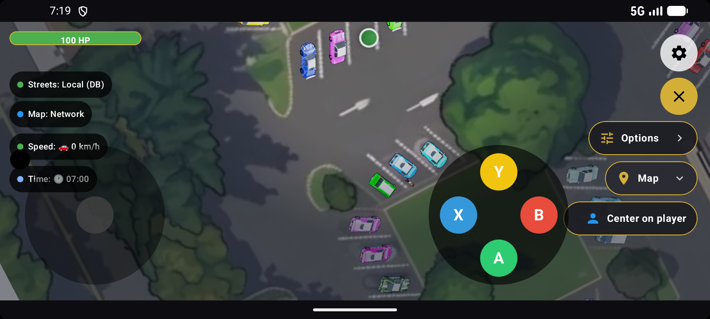
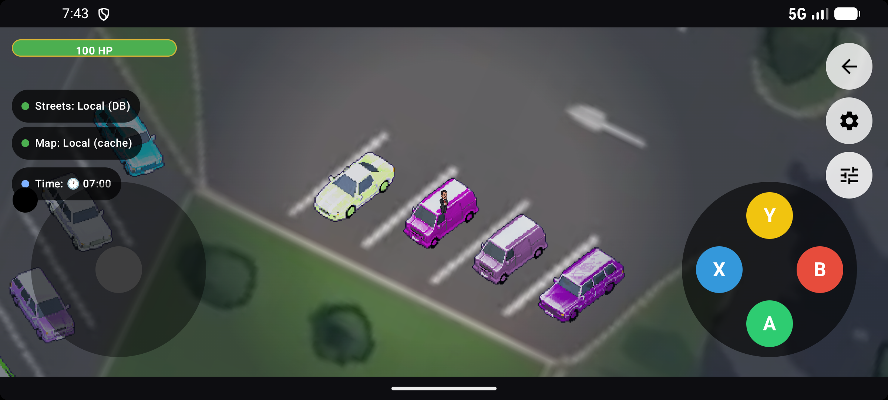
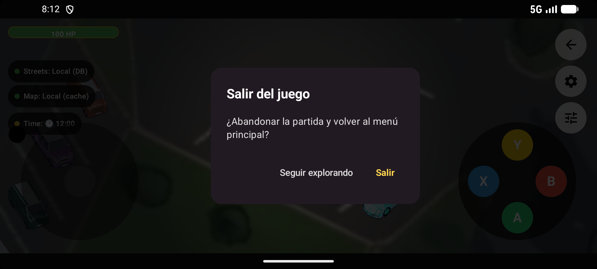
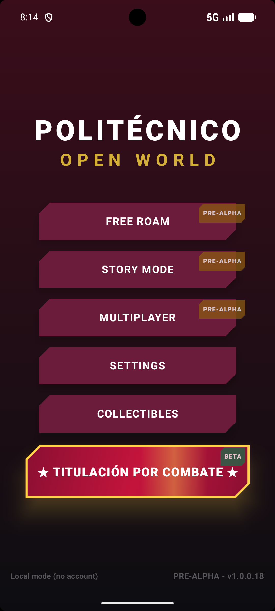

# Matriz de Pruebas de Aseguramiento de Calidad (QA)
**Proyecto:** Politécnico Open World (POW) - Módulo de Mapa Exterior  
**Autor:** Sofía Ortega García (Grupo 7CV4)  
**SHA Probado:** 7ed325393f82872c2be94ff2ada46948efa19152 (Base) + commit de salida

---

### TC01: Ruta Feliz (Éxito en la navegación de salida)
- **ID y criterio cubierto:** TC01 - Ruta Feliz (Criterio de aceptación 1)
- **Autor / Fecha:** Sofía Ortega, 30 de septiembre de 2026
- **Dispositivo / API:** Emulador Pixel 7 (Android API 37)
- **Precondiciones:** La app está abierta y el usuario se encuentra explorando en el modo "Mundo Libre" (Free Roam).
- **Pasos:**
  1. Localizar el botón con la flecha de salida en la esquina superior derecha de la pantalla.
  2. Hacer clic sobre el botón de salida.
  3. En el diálogo de confirmación que aparece, presionar el botón "Salir".
- **Resultado esperado:** Se abre el diálogo modal de confirmación y, al pulsar "Salir", la aplicación finaliza la sesión del mapa y regresa limpiamente al menú principal.
- **Resultado real:** El cuadro de diálogo se muestra correctamente y la app redirige de forma fluida al menú principal.
- **Estado:** ✅ Aprobado
- **Evidencias del recorrido:**

1. **Estado Anterior (Sin opción de salida en Mundo Libre):**
   

2. **Estado Actual (Con el botón de salida implementado arriba de Ajustes):**
   

3. **Cuadro de diálogo de confirmación ("Salir del juego"):**
   

4. **Retorno exitoso al Menú Principal:**
   

---

### TC02: Condición Alterna / Límite (Cancelar la salida)
- **ID y criterio cubierto:** TC02 - Condición Alterna (Criterio de aceptación 2)
- **Pasos:**
  1. Estando en el modo "Mundo Libre", presionar el botón de salida.
  2. En lugar de confirmar, hacer clic en "Seguir explorando" (o tocar fuera del diálogo).
- **Resultado esperado:** El diálogo se cierra de inmediato y el jugador permanece en su posición actual dentro del mapa sin perder ningún progreso ni sufrir bloqueos.
- **Resultado real:** El modal se descarta de forma limpia y la partida continúa con normalidad.
- **Estado:** ✅ Aprobado

---

### TC03: Regresión (Estabilidad de controles cercanos)
- **ID y criterio cubierto:** TC03 - Regresión en controles adyacentes
- **Pasos:**
  1. En la pantalla de "Mundo Libre", ubicar el botón de Ajustes (engrane) que se encuentra justo debajo del nuevo botón de salida.
  2. Presionar el botón de Ajustes.
- **Resultado esperado:** El menú de ajustes abre con normalidad sin que la presencia del nuevo botón de salida interfiera con su área táctil o eventos de clic.
- **Resultado real:** El botón de ajustes responde correctamente al toque.
- **Estado:** ✅ Aprobado

---

### TC04: Navegación y Estado (Uso del botón físico / gesto Atrás)
- **ID y criterio cubierto:** TC04 - Ciclo de vida y navegación
- **Pasos:**
  1. Estando en "Mundo Libre", presionar el botón físico o gesto de "Atrás" de Android.
- **Resultado esperado:** La acción gestiona la pila de navegación de forma adecuada sin cerrar la aplicación de golpe.
- **Resultado real:** Se comporta de manera estable integrándose con el dispatcher de la actividad.
- **Estado:** ✅ Aprobado

---

### TC05: Accesibilidad (Validación con lector de pantalla)
- **ID y criterio cubierto:** TC05 - Accesibilidad (TalkBack)
- **Pasos:**
  1. Activar TalkBack en el dispositivo/emulador.
  2. Enfocar el nuevo botón superior derecho con la flecha de retroceso.
- **Resultado esperado:** El lector de pantalla anuncia de forma clara la descripción configurada: *"Salir al menú principal"*.
- **Resultado real:** El componente es detectado por la accesibilidad leyendo el `contentDescription` exacto.
- **Estado:** ✅ Aprobado

---

### TC06: Compatibilidad / Entorno
- **ID y criterio cubierto:** TC06 - Entorno y visualización
- **Pasos:**
  1. Verificar la visualización del botón de salida y el diálogo modal en la resolución del emulador Pixel 7 en orientación horizontal.
- **Resultado esperado:** Los elementos gráficos no se desbordan, mantienen la proporción visual y respetan el tema visual del juego.
- **Resultado real:** El botón se alinea perfectamente en la columna superior derecha y el diálogo respeta el diseño modal oscuro con acentos dorados.
- **Estado:** ✅ Aprobado